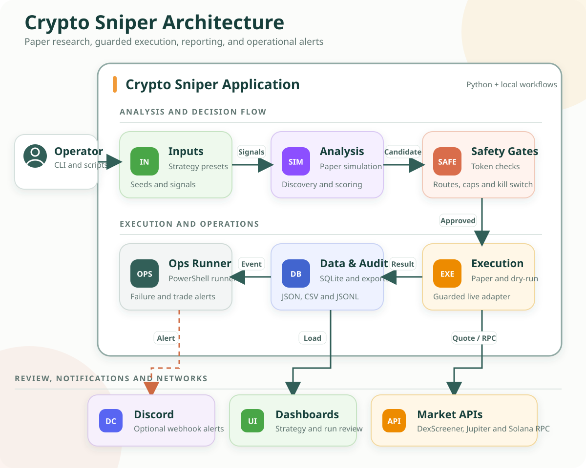

# Crypto Sniper

Crypto Sniper is a Python-based research and operations project for testing short-horizon Solana token trading workflows. It combines repeatable paper simulations, candidate discovery, safety filtering, guarded execution adapters, dashboards, and audit reporting.

> **Current status:** Paper simulation is the safest place to start. The live workflows are experimental, require operator supervision, and are designed for tightly limited test runs. This is not a plug-and-play trading bot and does not promise profitable results.

## What It Does

- Runs deterministic paper-trading simulations with configurable seeds and strategy presets.
- Discovers and scores token candidates using market signals.
- Checks liquidity, route availability, token properties, and operational safety rules.
- Supports paper, dry-run, and guarded live execution adapters.
- Applies controls such as allowlists, order caps, position limits, audit requirements, and a kill switch.
- Stores trading data in SQLite and exports JSON, CSV, and JSONL artifacts.
- Provides browser dashboards for strategy results, validation bundles, and live-operations review.
- Can send optional failure and trade-event alerts to Discord through the PowerShell operations runner.

## Architecture



## How It Works

1. An operator chooses a preset, seed, or signal source and starts a workflow.
2. The analysis layer runs a paper simulation or discovers and scores token candidates.
3. Liquidity, route, token-safety, and risk checks decide whether a candidate can continue.
4. An execution adapter handles the action in paper, dry-run, or guarded live mode.
5. Results are written to SQLite, JSON, CSV, and JSONL audit files.
6. The browser dashboards load those artifacts for review.
7. The PowerShell operations runner can send selected failures, executions, and settlement events to a Discord-compatible webhook.

In simple terms: the project collects or generates trading signals, checks whether they are safe enough to use, runs them through a controlled execution mode, and records the outcome for review.

## Technology Used

| Part | Tools |
| --- | --- |
| Core application | Python |
| Market integrations | DexScreener, Jupiter, Solana JSON-RPC |
| Storage and reports | SQLite, JSON, CSV, JSONL |
| Dashboards | HTML, CSS, JavaScript |
| Local automation | PowerShell, Windows batch scripts |
| Notifications | Discord-compatible webhooks |
| Testing | Pytest |

## Screenshots

### Strategy Review Dashboard


### Live Operations Dashboard


### Validation Bundle Viewer


## Project Structure

```text
.
|-- config/                # Strategy presets and safety profiles
|-- frontend/              # Browser dashboards
|-- src/discovery/         # Candidate and route discovery
|-- src/execution/         # Paper-trading engine and persistence
|-- src/filters/           # Liquidity and route filters
|-- src/live/              # Guarded execution, risk, audit, and reconciliation
|-- src/runner/            # Simulations and experiment runners
|-- tests/                 # Regression tests
|-- data/exports/          # Generated run artifacts
`-- run_regression_tests.py
```

## Run a Paper Simulation

Create a virtual environment and install the dependencies:

```powershell
python -m venv .venv
.venv\Scripts\Activate.ps1
python -m pip install -r requirements.txt
```

Run a deterministic simulation:

```powershell
python -m src.runner.paper_sim_runner --steps 50 --seed 1
```

Export a summary for the dashboards:

```powershell
python -m src.runner.paper_sim_runner `
  --steps 100 `
  --seed 7 `
  --export-json-dir data\exports `
  --export-csv-dir data\exports `
  --export-trades-csv-dir data\exports
```

## Open the Dashboards

Start a local web server:

```powershell
python -m http.server 8000
```

Then open:

```text
http://localhost:8000/frontend/index.html
```

The dashboards load local export files selected by the user. They do not require a separate frontend build.

## Run the Tests

Run the curated regression suite:

```powershell
python run_regression_tests.py
```

Avoid running database-writing tests in parallel on Windows because `data/sniper.db` can lock.

## Discord Alerts

The autonomous PowerShell runner can read a webhook URL from:

```text
CRYPTO_SNIPER_ALERT_WEBHOOK_URL
```

When the URL is a Discord webhook, the runner formats messages for failures, executed trades, and settled trades. The webhook is optional and should be stored only in the local environment, never committed to Git.

## Notes

- Paper results do not fully represent fees, slippage, latency, partial fills, or live market conditions.
- Live helpers are intended for supervised, tightly limited experiments rather than unattended production trading.
- Private keys, `.env` files, and webhook URLs must remain outside version control.
- External services such as DexScreener, Jupiter, and Solana RPC providers can fail or rate-limit requests.
- Read `LIVE_READINESS_NOTES.md` and `KNOWN_LIMITATIONS.md` before working with guarded live workflows.
- This project is for technical research and testing, not financial advice.
