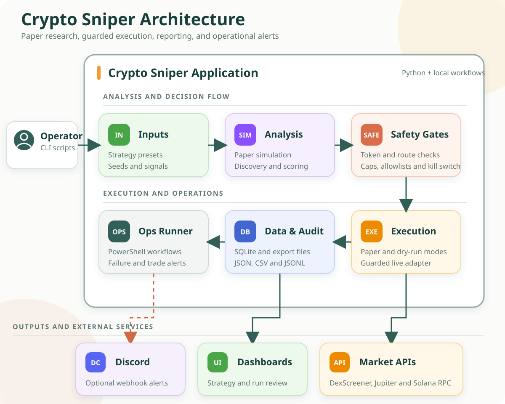
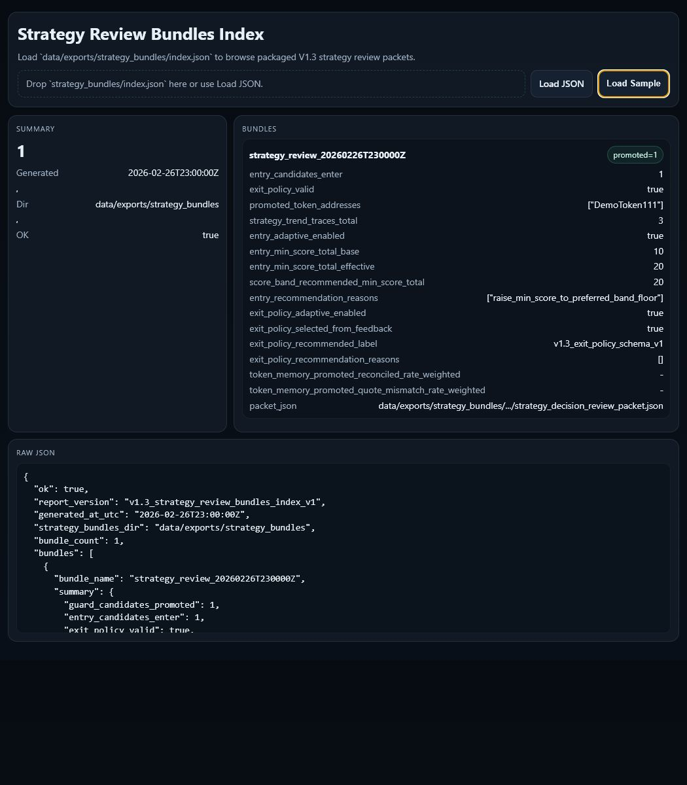
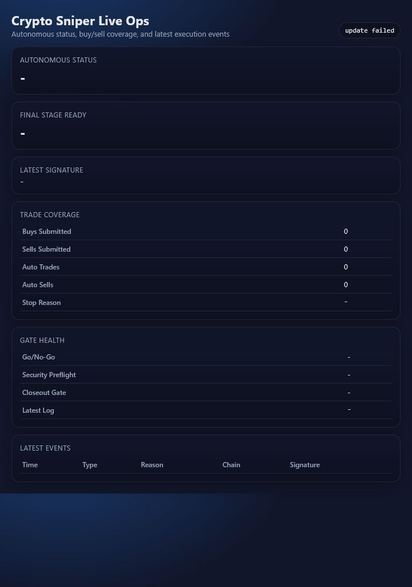
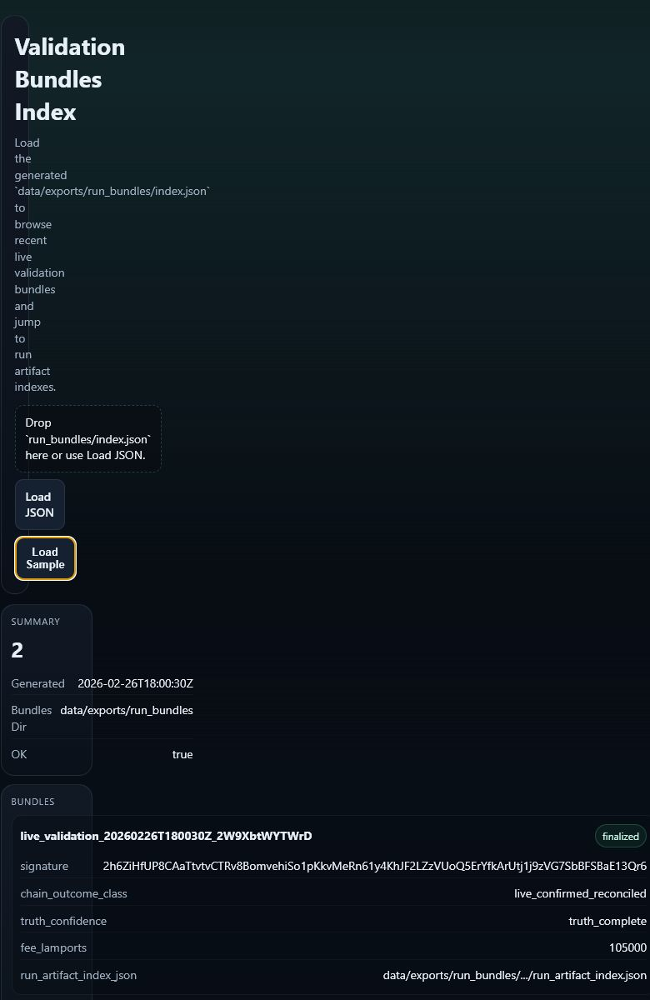

# Crypto Sniper

**Solana Trading Research and Risk-Control Platform**

Crypto Sniper is a Python project for testing Solana token trading workflows. It includes paper simulation, token discovery, safety checks, controlled execution modes, dashboards, and audit records.

> **Current status:** Start with paper mode. The live features are experimental and require operator supervision. This project does not promise profitable results.

## What It Does

- Runs repeatable paper-trading simulations.
- Finds and scores token candidates.
- Checks liquidity, swap routes, token safety, and risk limits.
- Supports paper, dry-run, and guarded live execution.
- Saves results as SQLite, JSON, CSV, and JSONL data.
- Shows results in browser dashboards.
- Can send optional failure and trade alerts to Discord.

## Architecture



## How It Works

1. The operator selects a strategy preset, seed, or signal source.
2. The project simulates trades or discovers token candidates.
3. Safety filters check the token, liquidity, route, and risk rules.
4. An execution adapter runs the action in paper, dry-run, or guarded live mode.
5. The result is saved for auditing and analysis.
6. Dashboards display the saved results, and optional Discord alerts report selected events.

In simple terms: it finds or creates trading signals, checks them, runs them through a controlled trading mode, and records what happened.

## Technology Used

| Part | Tools |
| --- | --- |
| Application | Python |
| Market data | DexScreener, Jupiter, Solana JSON-RPC |
| Storage | SQLite, JSON, CSV, JSONL |
| Dashboards | HTML, CSS, JavaScript |
| Automation | PowerShell, Windows batch scripts |
| Alerts | Discord webhooks |
| Testing | Pytest |

## Screenshots

### Strategy Review



### Live Operations



### Validation Results



## Run It Locally

Create a Python environment and install the dependencies:

```powershell
python -m venv .venv
.venv\Scripts\Activate.ps1
python -m pip install -r requirements.txt
```

Run a paper simulation and export a dashboard file:

```powershell
python -m src.runner.paper_sim_runner --steps 100 --seed 7 --export-json-dir data\exports
```

## Open the Dashboard

```powershell
python -m http.server 8000
```

Open:

```text
http://localhost:8000/frontend/index.html
```

Select an exported JSON, CSV, or JSONL file when the dashboard asks for data.

## Run the Tests

```powershell
python run_regression_tests.py
```

Database-writing tests should not run in parallel on Windows because `data/sniper.db` can lock.

## Project Structure

```text
config/          Strategy presets and safety profiles
frontend/        Browser dashboards
src/discovery/   Token and route discovery
src/execution/   Paper-trading engine
src/filters/     Liquidity and route filters
src/live/        Guarded execution and safety controls
src/runner/      Simulations and experiments
tests/           Regression tests
```

## Discord Alerts

The PowerShell operations runner can read a Discord webhook from:

```text
CRYPTO_SNIPER_ALERT_WEBHOOK_URL
```

The webhook is optional. Keep the real URL in the local environment and never commit it to Git.

## Safety Notes

- Paper results do not fully include fees, slippage, latency, or live market conditions.
- Live runs should be supervised and limited to very small test amounts.
- Keep private keys, `.env` files, and webhook URLs outside the repository.
- External market services can fail or rate-limit requests.
- Read `LIVE_READINESS_NOTES.md` and `KNOWN_LIMITATIONS.md` before using live features.
- This project is for technical research and testing, not financial advice.
